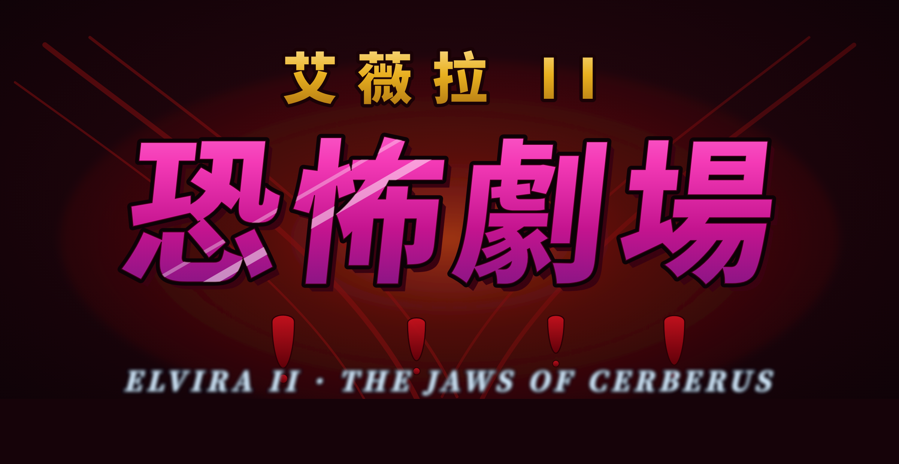
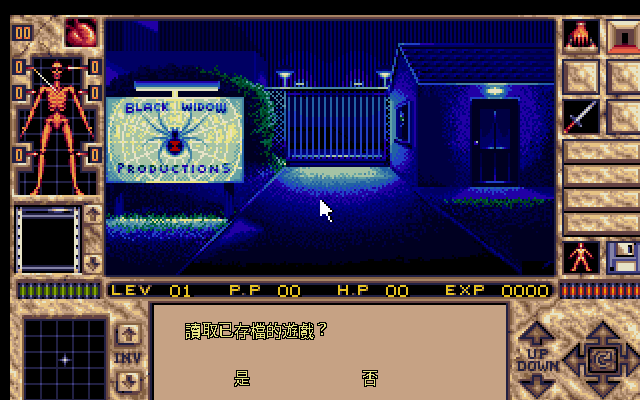
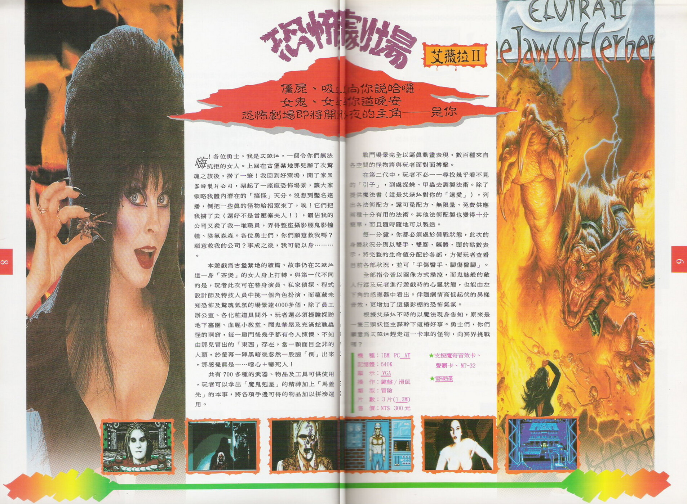
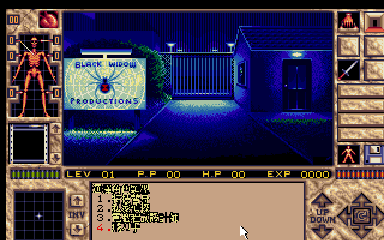
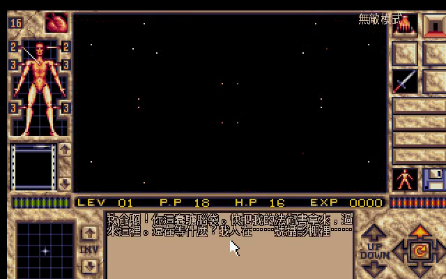
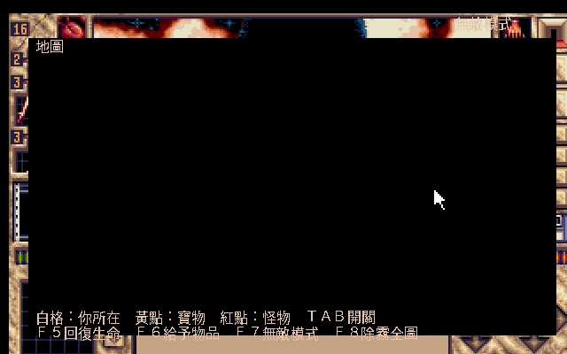
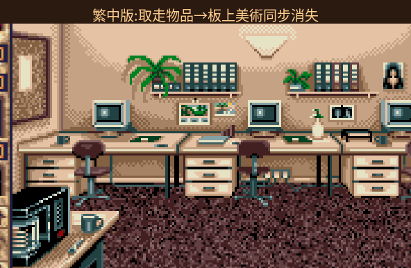

# 艾薇拉 II - 恐怖劇場　Elvira II: The Jaws of Cerberus（1991）繁體中文化

<p align="center">
  <br>
</p>

> **恐怖片女王被關進她自己的攝影棚，而攝影棚裡的怪物全是真的。**
> 一款 1991 年的即時戰鬥恐怖 RPG，Horror Soft／Accolade 出品、AGOS 引擎的巔峰之一、《神通妙巫師》(Simon the Sorcerer) 的直系祖先。
> 本專案把它**完整中文化**，跑在 patched 版 ScummVM 上，並替現代玩家補上一整套「不再被硬核勸退」的貼心功能。

<p align="center">
  <br>
  <em>開場第一句話，就是中文。</em>
</p>

## ▶ 推廣片

實機畫面 + 原版配樂，30 秒帶你看它說中文的樣子：

<p align="center">
  <a href="https://youtu.be/Y_aRagpMOok">
    <br>
    ▶ 在 YouTube 觀看
  </a>
</p>

## 🎡 線上試玩：中文密碼盤

當年防拷用的三層密碼盤，做成可轉動的線上還原（中文中心、三層皆可轉、幾何視窗透視真實數字、附解謎小遊戲）：

**➡ [開啟線上密碼盤](https://wicanr2.github.io/Elvira-2---The-Jaws-of-Cerberus-1991-cht/codewheel/)**　·　[專案入口站](https://wicanr2.github.io/Elvira-2---The-Jaws-of-Cerberus-1991-cht/)

---

## 遊戲介紹 — 當年軟體世界的邀請函

> 下面這段話，一字不改，來自 1991 年**軟體世界**在雜誌上刊登的原版廣告文案。艾薇拉親自對你喊話——三十多年前的行銷腔，今天讀來依然帶勁。

<p align="center">
  <br>
  <em>軟體世界當年的跨頁廣告（左頁艾薇拉本尊，右頁三頭地獄犬封面）。</em>
</p>

> **僵屍、吸血鬼向你說哈囉，女鬼、女巫對你道晚安；恐怖劇場即將開演——今夜的主角，是你。**

> 「嗨！各位勇士，我是艾薇拉，一個令你們無法抗拒的女人。上回在古堡禁地那兒辦了次驚魂之旅後，撈了一筆！我回到好萊塢，開了家黑寡婦製片公司，架起了一座座恐怖場景，讓大家領略我體內潛在的『搞怪』天分。沒想到豔名遠播，倒把一些真的怪物給招惹來了，唉！它們把我擄了去（還好不是當壓寨夫人！），霸佔我的公司又殺了我一堆職員，弄得整座攝影棚鬼影幢幢、陰氣森森。各位勇士們，你們願意救我嗎？願意救我的公司？事成之後，我可能以身………。」

本遊戲為《古堡禁地》的續篇，故事仍在艾薇拉這一身「茶煲」的女人身上打轉。與第一代不同的是，玩者此次可在**替身演員、私家偵探、程式設計師及特技人員**中挑一個角色扮演，而蘊藏未知恐怖及驚魂氣氛的場景達 **4000 多個**——除了員工辦公室、各化粧道具間外，玩者還必須提膽探訪地下墓園、血腥小教堂、鬧鬼華廈及充滿蛇蠍蟲怪的洞窟。每一扇門後幾乎都有令人悚慄、不知由那兒冒出的「東西」存在；當一顆面目全非的人頭，於螢幕一陣黑暗後忽然一股腦「倒」出來——那感覺真是……噁心＋嚇死人！

共有 **700 多種**的武器、物品及工具可供使用，玩者可以拿出「魔鬼剋星」的精神加上「馬蓋先」的本事，將各項手邊可得的物品加以拼湊運用。戰鬥場景完全以逼真動畫表現，數百種來自各空間的怪物將與玩者面對面搏擊。這一代玩者不必再一一尋找幾乎看不見的「引子」到處捉蛛、捉甲蟲去調製法術——艾薇拉留給你一本魔法書（這是她對你的「遺愛」），列出各法術配方；其他法術配製也變得十分簡單，隨時隨地可以製造。

每一分鐘，你都必須處於備戰狀態。此次的身體狀況分別以**雙手、雙腳、軀體、頭**的點數表示，把完整的生命值分於各部，方便查看目前各部狀況，並可「手傷醫手、腳傷醫腳」。全部指令皆以圖像方式操控，而鬼魅般的敵人行踪、以及玩者進行遊戲時的心靈狀態，也能由左下角的感應器中看出；伴隨劇情高低起伏的異樣音效，更增加了這攝影棚的恐怖氣氛。

> 根據艾薇拉不時以魔法現身告知，原來是一隻**三頭妖怪**主謀幹下這樁好事。勇士們，你們願意為艾薇拉趕走這一卡車的怪物，向冥界挑戰嗎？

> 📼 當年規格：IBM PC AT · 640K · VGA · 鍵盤／滑鼠 · 3 片磁片(1.2M) · 支援魔奇音效卡／聲霸卡／MT-32 · 售價 NT$300。

---

## 一、三十四年後，她終於會說中文了

1988 年，Horror Soft 的 Mike Woodroffe 帶著一套自製冒險引擎（後來被 ScummVM 稱作 **AGOS**）做出了《Elvira: Mistress of the Dark》(古堡禁地)。它把「圖形冒險」和「角色扮演」硬焊在一起——你要探索、解謎，也要練等、調配法術、跟怪物真刀真槍地打。三年後的續作 **《Elvira II - The Jaws of Cerberus》**，把這套公式搬進了好萊塢。

當年在台灣，這款遊戲由 **軟體世界（Softworld）** 代理，中文譯名就叫**《艾薇拉 II - 恐怖劇場》**。它的磁片標籤被設計成一張「入場券」，印著「**截角無效**」「**敬請『小心』進場**」——恐怖劇場的門票，這個梗三十四年後看依然講究。

只是，遊戲本體從來沒有中文。這個專案補上這塊：**2172 條字串、對白、物品、法術、選單、系統訊息，全部繁體中文化**，一個字都沒漏。

---

## 二、故事：她的攝影棚，變成了地獄的入口

你是恐怖片女王 **艾薇拉（Elvira）** 的男友。她在自己的製片公司 **黑寡婦製片公司（Black Widow Productions）** 拍片時失蹤了。你追進攝影棚，才發現三座巨大的攝影棚裡，那些「戲中戲」的佈景、道具、怪物——**全都活了過來**。

幕後黑手是艾薇拉的邪惡女巫祖先 **艾梅達女爵（Lady Emelda）**（沒錯，就是一代《古堡禁地》的大魔王），而台前把守著通往地獄之路的，是希臘冥界的三頭犬 **地獄犬（Cerberus）**——本作副標「**The Jaws of Cerberus（地獄犬之顎）**」的由來。

你得穿過三座攝影棚、對付活過來的戲中戲怪物、湊齊法術與道具，才能救出艾薇拉、把地獄犬打回牠該待的地方。

<p align="center">
  <br>
  <em>開場先選你的身分：特技替身、私家偵探、電腦程式設計師，還是飛刀手？</em>
</p>

### 🎬 三座攝影棚，三部戲中戲

| 攝影棚 | 主題 | 戲中戲片名 |
|---|---|---|
| **一號棚** | 昆蟲洞窟 | — |
| **二號棚** | 鬼屋 | 恐怖之屋 / 蜘蛛之吻 |
| **三號棚** | 地牢 | 墳墓來客 |

從活過來的巨蟻、巨蛛、殭屍、吸血鬼、報喪女妖，到二號棚服裝間掉「女巫之眼」的無名女巫——每一隻怪物、每一本典籍、每一段黑色幽默，都翻進了中文（連艾薇拉招牌的鹹濕雙關與 B 級恐怖片吐槽都盡量保留了原味）。

<p align="center">
  <br>
  <em>對白在遊戲裡逐句浮現 —— 不是選單、不是改圖，是真正玩起來的樣子。</em>
</p>

> 📖 快速上手（開場流程、四種職業、八大屬性、法術調配、友善化熱鍵）見 [**手冊要點索引**](docs/MANUAL.md)。

---

## 三、開玩：三種方式，挑一種

> ⚠️ **本專案是 patch-only**：只提供「中文化修改」與字型譯表，**不含遊戲原檔**。你需要自己合法擁有一份 Elvira 2 (Floppy/DOS) 的遊戲檔。

### 方式 A：下載完整包（最省事，Release 頁）

到本 repo 的 [Releases](../../releases) 下載對應平台的完整包：

- **Linux**：`Elvira2-CHT-FULL-x86_64.AppImage` — 加執行權限後雙擊即玩。
- **Windows**：`Elvira2-CHT-FULL-win64.zip` — 解壓後跑 `play-elvira2.bat`。
- **macOS**：`Elvira2-CHT-macOS-universal`（arm64 + Intel 通用）— patch-only，需自備遊戲檔放進 `game/`。

### 方式 B：自己套 patch（開發者）

見 [`docs/DEV_SETUP.md`](docs/DEV_SETUP.md)：一鍵腳本會抓 ScummVM v2.9.1、套上 `patches/agos-cht.patch`、編譯，並把字型譯表放好。

### 方式 C：把中文資產丟進你現成的 patched ScummVM

把 `fonts/elvira2_zh16.dcjk`、`elvira2_zh24.dcjk`、`elvira2_zh.tab` 放進遊戲資料夾，用套過 `agos-cht.patch` 的 ScummVM 開，就會自動切成繁中模式。

---

## 四、我們替現代玩家，把這款硬核老遊戲「馴服」了

Elvira 2 當年是出了名的難：即時戰鬥手忙腳亂、迷宮容易迷路、法術材料全靠猜、存檔一個不小心就走進死局。當年雜誌 CGW 甚至給了負評，說它「a grave disappointment」——不是因為不好玩，而是因為太容易卡死。

所以我們在**不改遊戲原檔**的前提下，用引擎疊層加了一整套**現代玩家友善化**功能。全部是熱鍵，隨開隨關：

<p align="center">
  <br>
  <em>按 <code>TAB</code>，迷宮變成一張看得懂的地圖 — 白格是你、黃點是寶物、紅點是怪物。</em>
</p>

| 熱鍵 | 功能 | 說明 |
|---|---|---|
| **`TAB`** | 動態地圖 | 即時繪出你走過的房間、出口、面向；**黃點標寶物、紅點標怪物** |
| **`F8`** | 除霧全圖 | 嫌探索太慢？一鍵攤開整張地圖 |
| **`F7`** | 無敵模式 | 生命與心靈力每幀補滿，純看劇情不再被打死；右上角顯示「無敵模式」 |
| **`F5`** | 回復生命 | 立即把 HP／心靈力補滿 |
| **`F6`** | 給予物品 | 卡在「就差一個道具」？把當前房間可拿的東西直接塞進背包 |

> 這些疊層畫在引擎的高解析層（640×400）上，中文是**原生點陣**、清晰不糊，跟遊戲原本的低解析畫面各走各的、互不干擾。

**關於「秒殺敵人」這類戰鬥作弊**：老實說，做不到得乾淨。AGOS 的即時戰鬥傷害判定藏在 VGA 腳本 bytecode 裡，引擎層沒有可靠的掛鉤點（這點跟姊妹作《蠟像館之謎》一樣，我們靜態分析全 dump 過）。所以我們選擇用 **F7 無敵**覆蓋「打不死」的需求——想純享受劇情與探索的玩家，開它就對了。

---

## 五、技術深潛：AGOS 為什麼不能「零 patch」中文化？

如果你做過 SCUMM 遊戲的中文化，你可能知道有些遊戲丟個字型檔就能切中文。**AGOS 沒有這條路。**

AGOS 引擎（Elvira 1/2、Waxworks、Simon 1/2）的文字渲染是為英文小點陣寫死的：它不認雙位元組、UI 動詞與存讀檔訊息硬編碼在原始碼裡、文字緩衝按英文字寬計算、320×200 的畫布也塞不下 24px 的全形中文。

所以本專案的核心，是一份集中式的引擎 patch —— [`patches/agos-cht.patch`](patches/agos-cht.patch)，全部改動都以 `// 非上游` 標記、用旗標控制、不破壞英文原路徑：

- **字串注入**：在 `getStringPtrByID()` 出口依 id 查譯表，命中就回傳 Big5 譯文。對白、旁白、物品名、選單全靠它。
- **高解析雙層畫布**：沿用引擎原本給 Elvira 1 PC98 日文版的 `_backBuf`(320×200) + `_scaleBuf`(640×400) 疊層機制，把中文畫在高解析層 → 原生點陣、相對變小、清晰。
- **雙位元組視窗文字**：改 `windowPutChar` 認 Big5 lead byte、正確前進欄寬。
- **存讀檔中文分支**：`saveload.cpp` 加 Big5 訊息。
- **防拷自動繞過**：Elvira 2 的防拷藏在遊戲 bytecode 裡（不是引擎旗標關得掉的），沒手冊會卡死。繁中版在腳本執行入口攔截、自動通過。完整根因與逆向過程見 **[防拷破解技術文件 →](docs/COPY_PROTECTION_FIX.md)**。當年那張防拷密碼盤也做成了線上還原版（中文中心、可轉動、附解謎）：**[中文密碼盤（線上還原）→](docs/codewheel/index.html)**。
- **佈告欄取物殘留修正**：原版把物品「畫死」在背景美術上，取走後圖不會消失（ScummVM 上的原版行為）。繁中版在引擎層蓋掉取走物品的美術，讓它同步消失。逆向與座標見 **[佈告欄取物調查 →](docs/NOTICE_BOARD_MECHANIC.md)**。

<p align="center">
  <br>
  <em>實機證明：取走物品後，板上的棕櫚、告示板、肖像、馬克杯同步消失（原版永遠殘留）。</em>
</p>

> 一個關鍵發現：Elvira 2 (`GType_ELVIRA2`) 和已完成的《蠟像館之謎》(`GType_WW`) 在 ScummVM 裡**同屬一個介面家族**，所以這份 patch 大量沿用了姊妹作的成果，再對位到 Elvira 2 的專屬路徑。

驗收標準不含糊：我們用引擎自己的反組譯器 dump 出**所有子程式引用過的字串 id（1465 條）**，逐一確認**全部命中譯表、零漏翻**，才算數。

### 📚 技術文件索引

| 文件 | 內容 |
|---|---|
| [防拷破解：符號碼防拷根因與修正](docs/COPY_PROTECTION_FIX.md) | 保全鍵盤／電子鎖門防拷為什麼引擎旗標關不掉、逆向過程、修正做法 |
| [除錯紀錄：疊層對齊與片頭跳過](docs/BUGFIX_NOTES.md) | 玩家回報問題的根因（中文短於英文→文字離開點擊框）、片頭 Enter 跳過、能力值八屬性對照 |
| [釋出狀況：玩家回報修正批次](docs/RELEASE_STATUS.md) | 各回報問題的修正／釋出狀態總覽、三平台包狀態、如何取得修正 |
| [佈告欄取物調查](docs/NOTICE_BOARD_MECHANIC.md) | 「拿走了板上還是有」的根因（烘死美術＋動態點擊框）、板上 14 件物品座標、繁中版視覺修正 |
| [原始發行版本考](docs/ELVIRA2_RELEASES.md) | Elvira 2 當年 DOS/Amiga/ST/C64 各版、五語在地化、ScummVM 指紋、為何本專案基於 floppy 英文版 |
| [中文密碼盤（線上還原）](https://wicanr2.github.io/Elvira-2---The-Jaws-of-Cerberus-1991-cht/codewheel/) | 當年防拷三層密碼盤的線上還原：中文中心、三層可轉動、幾何視窗透視真實數字、附解謎小遊戲 |
| [手冊要點索引](docs/MANUAL.md) | 開場流程、四職業、八屬性、法術調配、友善化熱鍵（整理自軟體世界中文說明書）|
| [手冊附錄：法術說明 · 開場提示](docs/MANUAL_APPENDIX.md) | 附錄一：10 級全法術表（名稱／法力／材料／效力）；附錄二：開場流程 13 點提示（整理自珍147 手冊）|
| [開發環境重建指南](docs/DEV_SETUP.md) | 佈局、改譯文重烘、改引擎重生 patch、headless 驗證、打包 |
| [背景研究資料](docs/elvira2_research.md) | 劇情、人物、系統、當年評價（含來源）|

---

## 六、譯名對照（對照現代通用譯名）

| 英文 | 繁中 | 備註 |
|---|---|---|
| Elvira | 艾薇拉 | 恐怖片女主持人「黑暗女王」 |
| Cerberus | 地獄犬 | 冥界三頭犬，副標來源 |
| Lady Emelda | 艾梅達女爵 | 艾薇拉的邪惡女巫祖先、幕後黑手 |
| Black Widow Productions | 黑寡婦製片公司 | 本作舞台 |
| Stuntman / Private Eye / Computer Programmer / Knife Thrower | 特技替身／私家偵探／電腦程式設計師／飛刀手 | 四種可選身分 |
| House of Horror / Kiss of the Spider / It Came from the Grave | 恐怖之屋／蜘蛛之吻／墳墓來客 | 三部戲中戲 |
| Fireball / Telekinesis / Resurrect / Bind Demon … | 火球術／念力／復活術／束縛惡魔 … | 法術調配系統 |

完整譯名表見 [`translations/glossary.md`](translations/glossary.md)。

---

## 七、檔案結構（patch-only，不含遊戲本體）

```
patches/agos-cht.patch      # 引擎中文化修改（套進 ScummVM v2.9.1）
fonts/elvira2_zh16.dcjk     # 16×16 Big5 點陣字型（視窗文字）
fonts/elvira2_zh24.dcjk     # 24×24 Big5 點陣字型（字幕/大字）
fonts/elvira2_zh.tab        # id → Big5 譯文對照表（2170 條）
translations/zh.tsv         # 人類可讀的譯文（id → 繁中）
translations/glossary.md    # 統一譯名表
tools/                      # 抽字 / 烘字型 / 建譯表 / 合併驗證
scripts/                    # 三平台打包 / 截圖 / dev-setup
docs/DEV_SETUP.md           # 開發環境重建指南
.github/workflows/macos.yml # macOS universal CI
```

> 遊戲原檔、MT-32 ROM、含版權配樂的影片一律不入庫。

---

## 八、致謝

- **Horror Soft / Accolade**（1991 原作）、**軟體世界 Softworld**（當年中文代理與「恐怖劇場」這個好名字）。
- **ScummVM 團隊**：沒有 AGOS 引擎的完整還原，這一切都無從談起。
- **骨灰集散地**：保存了當年的說明書掃描，讓這段歷史沒有消失。

姊妹作：[《蠟像館之謎》Waxworks 繁中化](https://github.com/wicanr2/waxworks_dos_cht)（同 AGOS 引擎家族）。

---

<p align="center"><em>「敬請『小心』進場。」</em></p>
