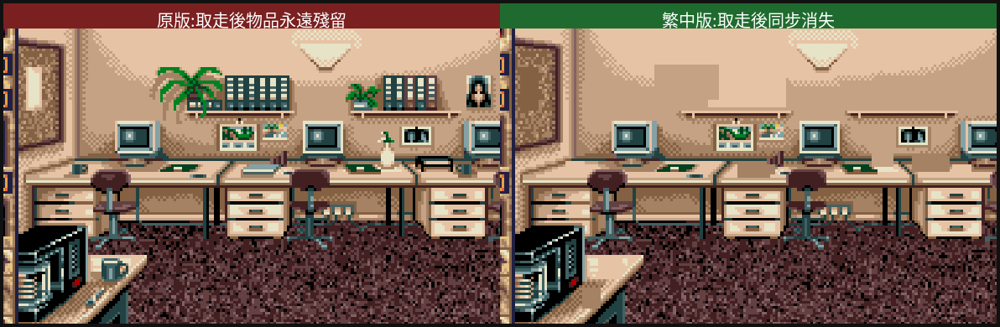

# 佈告欄取物調查：為什麼「拿走了板上還是有」

> 玩家回報：在佈告欄拿下物品後，佈告欄上仍然看得到原本的物品；清涼月曆拿了卻不在物品欄。
> 本文用引擎反組譯（dump oracle）追出根因，並記錄繁中版加的**視覺修正**。

## 一、結論先講

- **這是 1991 原版的設計，不是中文化造成的**：佈告欄背景是一張「把所有物品都畫死」的美術圖，取走物品只拿掉「可點擊區」、不會擦掉畫上的圖。
- **不影響遊戲流程**：物品確實拿得到（可點區會正確消失、防止重複拿），只是背景圖不即時更新，看起來像「還在」。
- 繁中版**額外**加了一層視覺修正（選配的現代友善化），讓拿走的物品在板上也跟著消失，避免玩家困惑。

## 二、根因：烘死的背景圖 + 動態點擊框

用引擎內建反組譯器 dump GAMEPC 子程式，定位到佈告欄近景的處理子程式 **`SUB_1085`**：

```
SUB_1085:  (佈告欄近景)
  ; 板子背景 = 一張 PICTURE,14 件物品(item 665–678)全畫在這張美術上
  IS_EQ [150] 0 ->                        ; 在佈告欄這個子場景時
  IS_SIBLING_WITH_A <677> ->              ; 這件物品還在板上嗎?(還是 691 的子物件?)
    ADD_BOX 16000 (x=100) 26 24 13 <677>  ; 還在 → 才在它畫上的位置疊一個「可點擊框」
  IS_SIBLING_WITH_A <678> -> ADD_BOX 16001 (x=169) 32 13 10 <678>
  ... (665–678 各一條,座標見下表)
  DEF_OBJ 0 <678> ... DEF_OBJ 13 <665>
```

機制拆解（第一性原理）：

1. **佈告欄是一張烘死的背景圖**（`PICTURE` opcode），14 件物品從一開始就畫在上面。
2. 每件物品另外用 `IS_SIBLING_WITH_A <item>` 判斷「還在板上嗎」，**還在才 `ADD_BOX` 疊一個看不見的點擊框**（座標正好蓋在畫上的物品位置）。
3. 你「拿走」一件（引擎通用 GET 動詞把它 re-parent 到你身上）→ 下次進來 `IS_SIBLING_WITH_A` 失敗 → **不再疊點擊框（不能再拿），但背景圖上畫的物品不會被擦掉**。

> ADD_BOX 座標編碼（`engines/agos/script.cpp` o_defineBox）：`id/1000`=旗標、`id%1000`=框 id；`x>=1000` 時 `x-=1000` 且 verb 記 0x4000 旗標。所以下表 x 已還原（raw−1000）。

### 板上 14 件物品的位置（320×200 板圖座標）

| item | x | y | w | h | | item | x | y | w | h |
|---|---|---|---|---|---|---|---|---|---|---|
| 677 | 100 | 26 | 24 | 13 | | 671 | 79 | 98 | 9 | 8 |
| 678 | 169 | 32 | 13 | 10 | | 670 | 67 | 62 | 7 | 5 |
| 676 | 120 | 30 | 29 | 12 | | 669 | 211 | 63 | 7 | 4 |
| 675 | 183 | 30 | 20 | 12 | | 668 | 73 | 109 | 7 | 8 |
| 674 | 214 | 30 | 10 | 12 | | 667 | 181 | 51 | 8 | 13 |
| 673 | 111 | 39 | 13 | 3 | | 666 | 196 | 60 | 14 | 6 |
| 672 | 50 | 27 | 7 | 16 | | 665 | 131 | 63 | 14 | 4 |

初始化子程式把這 14 件 `SET_PARENT <item> <691>`（釘到佈告欄 691）。取走走的是**引擎通用 GET 動詞**，dump 中沒有逐物品的取物 bytecode。

## 三、清涼月曆「拿了卻不在物品欄」

- 「girlie calendar」是**物品名字串**（GAMEPC 字串表 id 938），不是靠 `SHOW_STRING` 顯示，所以在子程式 dump 裡看不到它被「印出」。
- 板上物品取走後進的是玩家的背包容器（介面上那個手提箱／道具欄表徵），不是消失。玩家回報「另外 5 個物品拿下來了」本身就證明取物機制正常。
- 「檢查房間」icon 只是把當前場景可見物品列在下方，**看到 ≠ 已取得**；要真正拿到得對它下「拿取」動作。

## 四、繁中版的視覺修正（選配友善化）

因為背景圖是烘死的，要讓「拿走的物品在板上也消失」，只能在引擎層**主動蓋掉**該物品畫上的矩形。繁中版利用上面 dump 出的**精確座標**，在佈告欄近景重繪時：對每一件「已不在板上（parent≠691）」的物品，用板子的軟木塞底色蓋掉它的矩形。

- 判定「當前是哪個板的近景」用 `me()->parent`（玩家所在容器）——佈告欄近景的機制正是把玩家移進板容器（`SUB_1085` 用 `IS_SIBLING_WITH_A`＝`o_here`＝`me()->parent==item->parent` 篩板上物品），故玩家所在容器就是正在看的板。以此為 gate 精準、且涵蓋「全部取走」的情況。
- 全部 `// 非上游` gate、`_chtActive` 旗標控，跨此類場景通用（遊戲裡不只一個烘死美術板）。
- 屬「現代玩家友善化」層（與 TAB 地圖、F7 無敵同層），不改遊戲原檔、不破壞英文原路徑。
- 實作與掛勾點見 `patches/agos-cht.patch`（`defineBox` 記錄、`chtEraseTakenBoardItems` 每幀重繪蓋圖）。

### 修補效果（實機證明）


上圖為 patched 引擎實機錄製：在佈告欄近景把 14 件物品逐一取走，畫上的物品**同步消失**（用周邊軟木塞／牆色蓋掉），而非原版那樣永遠殘留。



左＝原版行為（取走後物品永遠留在烘死的美術上）；右＝繁中版（取走後同步清除）。棕櫚盆栽、告示板、肖像、馬克杯等在取走後都正確消失。

> **驗證方法（誠實記錄）**：以引擎反組譯器 dump 出的座標為權威，加臨時除錯鉤強制叫出 `SUB_1085` 近景並逐件取物，用 `-d1` log 確認「14 件以與 dump 完全吻合的座標被記錄、erase 精準只蓋已取走的、cork 色取自周邊」；再以像素差異圖確認變化區正好落在物品座標（零偏移）＋物品同時出現在背包欄。驗證過程中發現並修掉「全部取走時偵測失效」的 edge case（改用 `me()->parent`）。臨時除錯鉤測完已全部移除，patch 保持乾淨。

## 參考

- 反組譯技巧與 AGOS 資料模型：專案根 `CLAUDE.md` §1/§4、`docs/DEV_SETUP.md`。
- 其他修正：[除錯紀錄](BUGFIX_NOTES.md)、[防拷破解](COPY_PROTECTION_FIX.md)。
